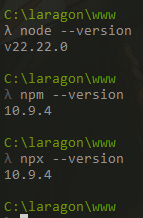
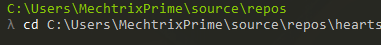
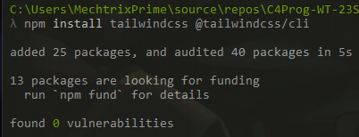
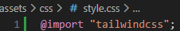
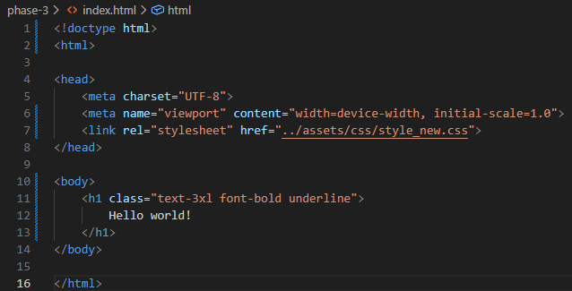

Here's the simple fix for "**C-WT-AT2-POR-Phase-3**" document
Located on page 6, under "Install & Configure Tailwind CSS".

Fix to get past this section: 
--
Instead of runing:

```
npm install -D tailwindcss
```

which works and then 
```
npx tailwindcss init 
```

Which doesn't work due to it being removed in v4.

---

Instead now, in v4 there are a few different methods to install Tailwind CSS.

Firstly you have to check if 
`node`, `npm` and `npx` is the correct version similar to this ->

 

Then move to your projects directory using 
```bash
cd my-project
```
Which should then look like:



Then you can proceed with the installation

__Suggested Method:__ Installation using Tailwind CLI:
--
Now Installation with Tailwind CLI, is quite simple

1. Install Tailwind CSS with CLI
using the command:
```bash
npm install tailwindcss @tailwindcss/cli
```

Which should show something like:



2. import Tailwind CSS by adding `@import "tailwindcss";` into your main CSS file.

Like this:




3. Then Start the Tailwind CLI build process 

Note: you might want to create another css file for the output of the build process
```bash
npx npx @tailwindcss/cli -i assets\css\style.css -o assets\css\style_new.css --watch
```
What this does:

`-i assets\css\style.css` Tells Tailwind CLI where to import from this CSS file.

`-o assets\css\style_new.css` Tells Tailwind CLI where to export the finished built process.


4. Then you can start using Tailwind in your HTML

By first adding `<link rel="stylesheet" href="../assets/css/style_new.css">`
to your html file.

Then you can use it like this



Which should then display:


__The Other Methods:__ Vite And PostCSS:
--

Due to these methods requiring Frameworks to install, I won't recommand using them, as Using extra frameworks are not part of the assessment

Installation for Vite: https://tailwindcss.com/docs/installation/using-vite

Installation for PostCSS: https://tailwindcss.com/docs/installation/using-postcss


__Older Method:__ Install Tailwind v3:
--
If the assessment requires you to install the older version
here is the fix.
Instead of running: 

```bash
npm install -D tailwindcss
```

Which installs the latest version

Run this instead:

```bash
npm install -D tailwindcss@3
``` 

Which installs the latest version 3 of tailwind.
Then you should be able to continue the rest of the assessment without any issues.

---

Note: All of these Instructions are gathered from the offical Tailwind v4.3 Installation Guide
- source: https://tailwindcss.com/docs/installation/using-vite

Note: Screenshots was tested within my own pc, on my own project, path to your projects may vary.